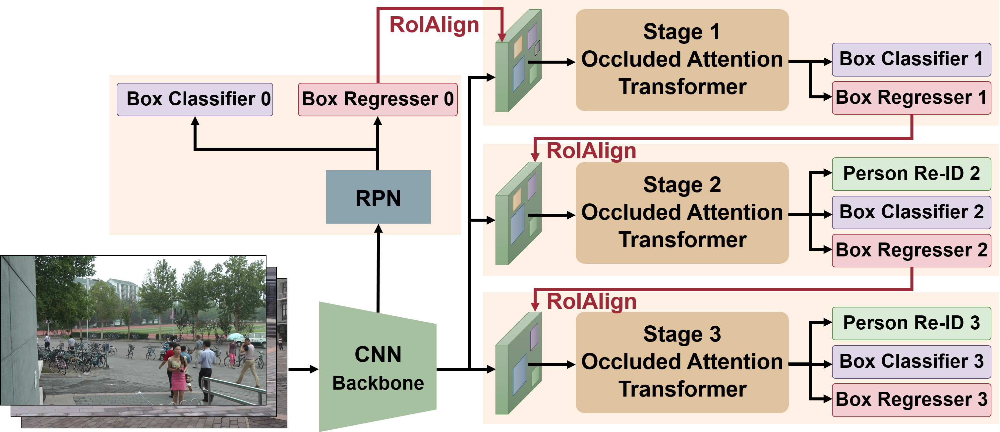

This repository hosts the source code of our paper: [[CVPR 2022] Cascade Transformers for End-to-End Person Search](). In this work, we developed a novel Cascaded Occlusion-Aware Transformer (COAT) model for end-to-end person search. The COAT model outperforms **state-of-the-art** methods on the PRW benchmark dataset by a large margin and achieves state-of-the-art performance on the CUHK-SYSU dataset. 

| Dataset   | mAP  | Top-1 | Model                                                        |
| --------- | ---- | ----- | ------------------------------------------------------------ |
| CUHK-SYSU | 94.2 | 94.7  | [model](https://drive.google.com/file/d/1LkEwXYaJg93yk4Kfhyk3m6j8v3i9s1B7/view?usp=sharing) |
| PRW       | 53.3 | 87.4  | [model](https://drive.google.com/file/d/1vEd_zzFN88RgxbRMG5-WfJZgD3vmP0Xg/view?usp=sharing) |

**Abstract**: The goal of person search is to localize a target person from a gallery set of scene images, which is extremely challenging due to large scale variations, pose/viewpoint changes, and occlusions. In this paper, we propose the Cascade Occluded Attention Transformer (COAT) for end-to-end person search. Specifically, our three-stage cascade design focuses on detecting people at the first stage, then progressively refines the representation for person detection and re-identification simultaneously at the following stages. The occluded attention transformer at each stage applies tighter intersection over union thresholds, forcing the network to learn coarse-to-fine pose/scale invariant features. Meanwhile, we calculate the occluded attention across instances in a mini-batch to differentiate tokens from other people or the background. In this way, we simulate the effect of other objects occluding a person of interest at the token-level. Through comprehensive experiments, we demonstrate the benefits of our method by achieving state-of-the-art performance on two benchmark datasets.




## Installation
1. Download the datasets in your path `$DATA_DIR`. Change the dataset paths in L4 in [cuhk_sysu.yaml](configs/cuhk_sysu.yaml) and [prw.yaml](configs/prw.yaml).

**PRW**:

```
cd $DATA_DIR 
pip install gdown
gdown https://drive.google.com/uc?id=0B6tjyrV1YrHeYnlhNnhEYTh5MUU
unzip PRW-v16.04.20.zip 
mv PRW-v16.04.20 PRW 
```

**CUHK-SYSU**:

```
cd $DATA_DIR 
gdown https://drive.google.com/uc?id=1z3LsFrJTUeEX3-XjSEJMOBrslxD2T5af 
tar -xzvf cuhk_sysu.tar.gz 
mv cuhk_sysu CUHK-SYSU 
```

2. Our method is tested with PyTorch 1.7.1. You can install the required packages by anaconda/miniconda with the following commands: 

```
cd COAT 
conda env create -f COAT_pt171.yml 
conda activate coat 
```

If you want to install another version of PyTorch, you can modify the versions in `coat_pt171.yml`. Just make sure the dependencies have the appropriate version. 


## Experiments on CUHK-SYSU
**Training**: The code currently only supports single GPU. The default training script for CUHK-SYSU is as follows:

``` 
cd COAT 
python train.py --cfg configs/cuhk_sysu.yaml INPUT.BATCH_SIZE_TRAIN 3 SOLVER.BASE_LR 0.003 SOLVER.MAX_EPOCHS 14 SOLVER.LR_DECAY_MILESTONES [11] MODEL.LOSS.USE_SOFTMAX True SOLVER.LW_RCNN_SOFTMAX_2ND 0.1 SOLVER.LW_RCNN_SOFTMAX_3RD 0.1 OUTPUT_DIR ./logs/cuhk-sysu 
```

Note that the dataset-specific parameters are defined in `configs/cuhk_sysu.yaml`. When the batch size (`INPUT.BATCH_SIZE_TRAIN`) is 3, the training will take about 23GB GPU memory, being suitable for GPUs like RTX6000. When the batch size is 5, the training will take about 38GB GPU memory, being able to run on A100 GPU. The larger batch size usually results in better performance on CUHK-SYSU. 

For the CUHK-SYSU dataset, we use a relative low weight for softmax loss (`SOLVER.LW_RCNN_SOFTMAX_2ND` 0.1 and `SOLVER.LW_RCNN_SOFTMAX_3RD` 0.1). The trained models and TF logs will be saved in the folder `OUTPUT_DIR`. Other important training parameters can be found in the file `COAT/defaults.py`. For example, `CKPT_PERIOD` is the frequency of saving a checkpoint model. 

**Testing**: The test script is very simple. You just need to add the flag `--eval` and provide the folder `--ckpt` where the [model](https://drive.google.com/file/d/1LkEwXYaJg93yk4Kfhyk3m6j8v3i9s1B7/view?usp=sharing) was saved.

``` 
python train.py --cfg ./configs/cuhk-sysu/config.yaml --eval --ckpt ./logs/cuhk-sysu/cuhk_COAT.pth 
```

**Testing with CBGM**: Context Bipartite Graph Matching ([CBGM](https://github.com/serend1p1ty/SeqNet)) is an optimized matching algorithm in test phase. The detail can be found in the paper [[AAAI 2021] Sequential End-to-end Network for Efficient Person Search](https://arxiv.org/abs/2103.10148). We can use CBGM to further improve the person search accuracy. In test script, we just set the flag `EVAL_USE_CBGM` to True (default is False). 

```
python train.py --cfg ./configs/cuhk-sysu/config.yaml --eval --ckpt ./logs/cuhk-sysu/cuhk_COAT.pth EVAL_USE_CB GM True
```
 
**Testing with different gallery sizes on CUHK-SYSU**: The default gallery size for evaluating CUHK-SYSU is 100. If you want to test with other pre-defined gallery sizes (50, 100, 500, 1000, 2000, 4000) for drawing the CUHK-SYSU gallery size curve, please set the parameter `EVAL_GALLERY_SIZE` with a gallery size. 

```
python train.py --cfg ./configs/cuhk-sysu/config.yaml --eval --ckpt ./logs/cuhk-sysu/cuhk_COAT.pth EVAL_GALLER Y_SIZE 500 
```

## Experiments on PRW
**Training**: The script is similar to CUHK-SYSU. The code currently only supports single GPU. The default training script for PRW is as follows: 

```
cd COAT 
python train.py --cfg ./configs/prw.yaml INPUT.BATCH_SIZE_TRAIN 3 SOLVER.BASE_LR 0.003 SOLVER.MAX_EPOCHS 13 MODEL.LOSS.USE_SOFTMAX True OUTPUT_DIR ./logs/prw
```

The dataset-specific parameters are defined in `configs/prw.yaml`. When the batch size (`INPUT.BATCH_SIZE_TRAIN`) is 3, the training will take about 19GB GPU memory, being suitable for GPUs like RTX6000. The larger batch size does not necessarily result in better accuracy on the PRW dataset. 
Softmax loss is effective on PRW. The default weights of softmax loss at Stage 2 and Stage 3 (`SOLVER.LW_RCNN_SOFTMAX_2ND` and `SOLVER.LW_RCNN_SOFTMAX_3RD`) are 0.5, which can be found in the file `COAT/defaults.py`. If you want to run a model without Softmax loss for comparison, just set `MODEL.LOSS.USE_SOFTMAX` to False in the script. 


**Testing**: The test script is similar to CUHK-SYSU. Make sure the path of pre-trained model [model](https://drive.google.com/file/d/1vEd_zzFN88RgxbRMG5-WfJZgD3vmP0Xg/view?usp=sharing) is correct.

``` 
python train.py --cfg ./logs/prw/config.yaml --eval --ckpt ./logs/prw/prw_COAT.pth 

```

**Testing with CBGM**: Similar to CUHK-SYSU, set the flag `EVAL_USE_CBGM` to True (default is False). 

```
python train.py --cfg ./logs/prw/config.yaml --eval --ckpt ./logs/prw/prw_COAT.pth EVAL_USE_CBGM True
```


## Acknowledgement
This code borrows from [SeqNet](https://github.com/serend1p1ty/SeqNet), [TransReID](https://github.com/damo-cv/TransReID), and [DSTT](https://github.com/ruiliu-ai/DSTT).

## Citation
If you use this code in your research, please cite this project as follows:

```
@inproceedings{yu2022coat,
  title     = {Sequential End-to-end Network for Efficient Person Search},
  author    = {Rui Yu and 
               Dawei Du and 
               Rodney LaLonde and 
               Daniel Davila and 
               Christopher Funk and 
               Anthony Hoogs and 
               Brian Clipp},
  booktitle = {{IEEE} Conference on Computer Vision and Pattern Recognition},
  year      = {2022}
}
```

##License
This work is distributed under the OSI-approved BSD 3-Clause [License](https://github.com/Kitware/COAT/blob/master/LICENSE).
